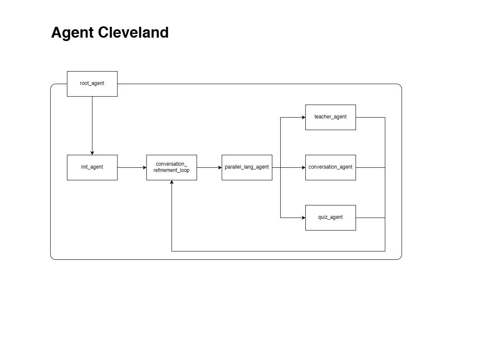

# Agent Cleveland
Agent Cleveland is your buddy to learn a new language. 

It is part of Kaggle's 5-Day AI Agents Intensive Course with Google submission. 

### Problem Statement
Learning a new language is challenging because most learners struggle to stay motivated, receive timely feedback, and practice consistently in real-life contexts. Traditional apps often provide static lessons that cannot adapt to a learner's evolving needs or respond meaningfully to their questions. As a result, many learners lose confidence, or fail to build practical conversational skills. There is a need for an intelligent, responsive system that can engage learners dynamically, personalize their learning path, and offer real-time practice that feels natural and supportive. Agent Cleveland aims to address this gap by providing interactive, adaptive, and context-aware guidance to help users learn more effectively.

### Solution Statement
The **Autonomous AI Language Helper** is designed to solve this experience bottleneck by automating the end-to-end instructional conversation. By mimicking a human expert, you will be benefited from an agent that can explain nuances, correct mistakes, and tailor guidance to their specific needs. This agent acts like a patient tutor who adapts to the learner’s pace, interests, and goals, making language practice feel intuitive and human. 

### Architecture

This architecture defines a multi-agent system designed to deliver an adaptive, expert-driven language-learning experience. At the top level, a `root_agent` orchestrates the overall workflow. It first delegates to the `init_agent`, which handles initial setup—collecting user goals, proficiency level, and context. The output flows into the `conversation_refinement_loop`, a central module that continuously processes user interactions, refines intent, and maintains conversational state throughout the session.

From there, the system hands control to the `parallel_lang_agent`, which acts as a coordinator for specialized language agents. This agent branches the request to three expert sub-agents:

* `teacher_agent` which provides direct instruction, explanations, and structured learning guidance
* `conversation_agent` which engages the user in natural dialogue practice and simulates real conversational scenarios
* `quiz_agent` which generates assessments, quick checks, and reinforcement exercises

Each of these expert agents sends its responses back into the architecture’s main loop, ensuring that all outputs are refined and integrated consistently before being delivered to the user. The closed-loop structure allows the system to adapt dynamically, maintain coherence, and personalize the user’s learning experience in real time.

## Installation
This project was built against Python 3.11.3. To start, 
1. Install the required packages using `pip install -r requirements.txt`. 
2. Add the API key in environment variables. 

To run the agent, please the following command at the root folder of this project: 
`adk create lang-agent --api_key $GOOGLE_API_KEY`. 

> [!NOTE]
> Make sure your `$GOOGLE_API_KEY` is set in your computer. 

To use the agent, run the ADK web UI using the following command: 

`adk web`

### Debugging
This project has configurations on the log while using the agent. Run the ADK web UI using the following command: 

`adk web --log_level DEBUG`

## Project Structure
The project is organized as follows:
* `lang-agent/`
  * `agent.py` defined all agents
  * `config.py` defines the Gemini backend
  * `tools.py` contains the function that assists the conversation and language learning journey
* `plugin/`
  * `CountInvocationPlugin.py` counts how many invocation
* `public/` contains the images and other auxiliary files for this project
* `test/` tests the agent

## Workflow
The agent works as following: 
1. The user will ask help for one language. To do this, use the `find_lang_agent` agent. 
2. You then ask what the user want to do today. They will prompt you based on the following options: 
   *  **Teach** You provide them one example of using the language. 
   *  **Conversation** You and the user talks with the language casually. 
   *  **Quiz** You ask the user a word from the language.  
